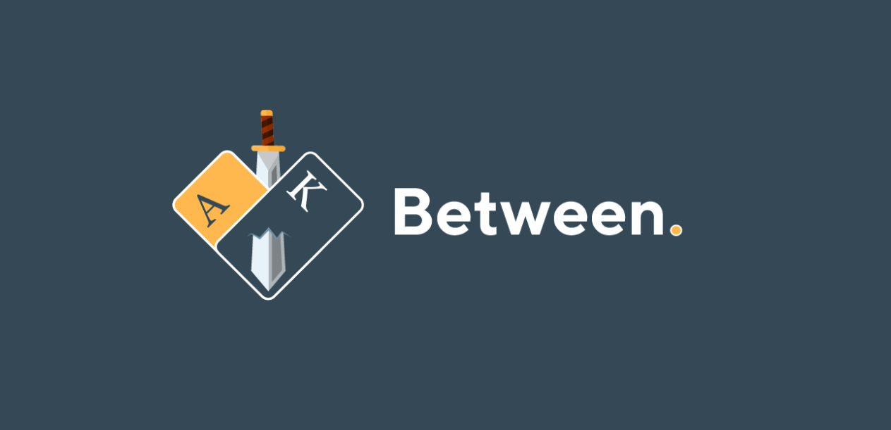

# Between - Game Rules

## Get in Between

The game is simple. First two cards will form a range and you draw the third card. If the third card is in between of the range, you win. Else, you lose. 

Ace is the smallest while King is the biggest. In ascending order, the order of face value is `A, 2, 3, 4, 5, 6, 7, 8, 9, 10, J, Q, K` . Suit does not matter in this game.

These are the rules for different stage, aka the

### Ante stage 

where an Ante is fired and first two card is revealed

* **Same cards**: Player automatically wins 3 to 1 as per Ante amount and round ended. 
* **Consecutive cards**: Player automatically loses Ante and round ended. 
* **Call**: Player send in call amount which they would like to win from the pot, together with clash amount. The third card will be dealt after the call. Do note that each Ante has 2 minutes of validity, round is ended when Ante is expired. No refund on expired Ante.
* **Fold**: Player surrenders the hand and round is ended.

### Call stage

where the third card is revealed. There are 3 outcomes:

* **Between the range**: Player wins the Call amount. 
* **Out of range**: Player loses the Call amount.
* **Clash on range**: Player loses the Call and Clash amount.

### Types of transferable bets

**Ante**: A non-refundable fee to reveal the first two cards. Call amount will not exceed 20 times of Ante.

**Call**: The amount you would like to take away from the pot. Call amount is flexible but has a maximum of 20 times the Ante. E.g. Player can only call up to 100 STEEM if their Ante was 5 STEEM for that round.

**Clash**: Always equal to Call amount and to be sent in together with Call. Refund at the end of round except in Clash case.

## Clash

Clash is the essence of Between. It is the ultimate penalty that can be happened to an ambitious player, the last thing a player would hope for when making a Call, is Clash. On the other hand, as a player you also always hope the other players to Clash as hard as they can, so the pot can grow exponentially and you can reap the profit with a single blow.

Due to the nature of this game, Clash amount will always be coupled with the Call amount and be fired as an official Call bet. As long as the third card is not the same as the first two, Clash amount will be refunded.

## Pot cleared

The pot has a threshold of 10 STEEM, pot is considered cleared if balance falls below the line.

When pot is cleared, all pending Ante and Call bets that are yet to be processed, will be voided and refunded. This is the only case where refund of Ante is possible. A one minute cooldown period will be started and 100 STEEM will be topped up to the pot to start a new round thereafter.

## Profit allocation

**Ante**: 50% goes to @epicbetween as top up reserve. 40% goes to @epicdice as house profit \(for dividend sharing\). 10% goes to @betweenpot to increase the pot size.

**Call and Clash**: 100% goes to @betweenpot.

House will have zero claims from whatever is holding by @betweenpot as it serve as a pot for players to win from. In other words, player does not has to be desperate after losing in Call and Clash as house will not take a cent from pot fund. Player can always "take it back", of course, as long as other players have not cleared the pot yet.

## Provably fair

Each Ante and Call are independent verifiable event as they are generated using their own server seed and Transaction ID\(TXID\) respectively. Here is how you can verify the Between result before we get the fairness tool ready. Card mapping and verification code and be found [_here_](https://epicdice.gitbook.io/epicdice/untitled#between).

1. Note down the **TXID** and **server** **hash** of Ante/Call from steemd.com.
2. After 2 minutes the **server seed** is revealed via a broadcast from @epicdice to @epictoken. Note the server seed down from steemd.com.
3. Go to [_playcode.io_](https://playcode.io/470482?tabs=script.js,preview,console) where the source code of card generator is available.
4. Input the collected TXID and server seed into the first four variables.
5. Play the code, the result generated should be tally with what you've got in the game.

## Things to note

* Between is meant to be conducted strictly under our game site only. 
* We are not responsible for any losses in bot attempt.
* Ante is not refundable except pot cleared case, due to the nature of this game.
* Minimum Ante is 1 STEEM.

### _Example of game cases_

* _E.g. Player Ante 5 STEEM and the first two cards are 8, player is paid with total 15 STEEM._
* _E.g. Player Ante 5 STEEM and the first card is 2, second card is 3, round ends._
* _E.g. First two cards are 4 and J and player called 100 STEEM\(total send in 200 STEEM\), third card is 8. Player wins 100 STEEM from pot and get back the 200 STEEM Call and Clash amount too._
* _E.g. First two cards are 4 and J and player called 100 STEEM\(total send in 200 STEEM\), third card is 2. Player loses 100 STEEM to the pot. Get back 100 STEEM Clash amount._
* _E.g. First two cards are 4 and J and player called 100 STEEM\(total send in 200 STEEM\), third card is J. Players loses 200 STEEM to the pot._

